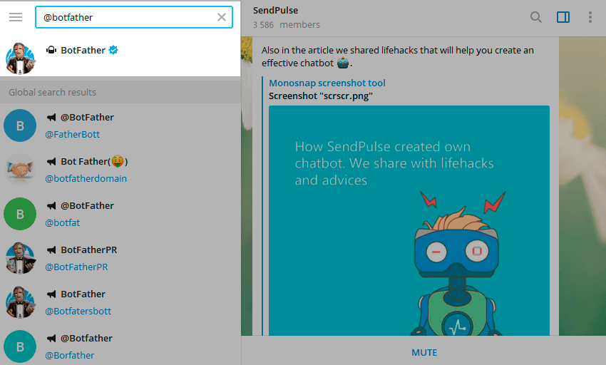
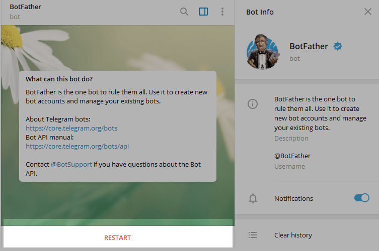
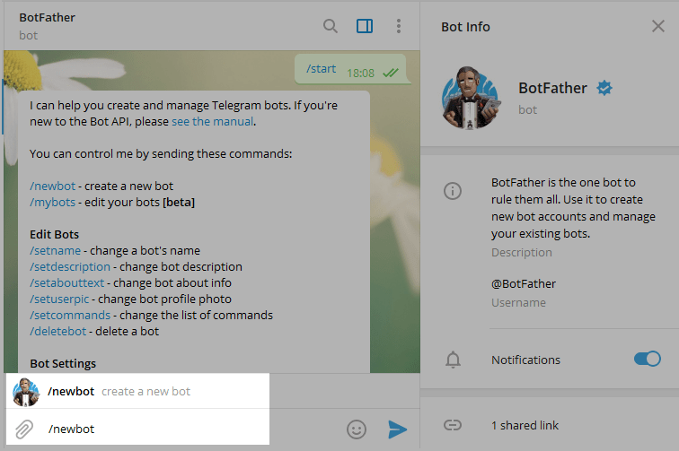
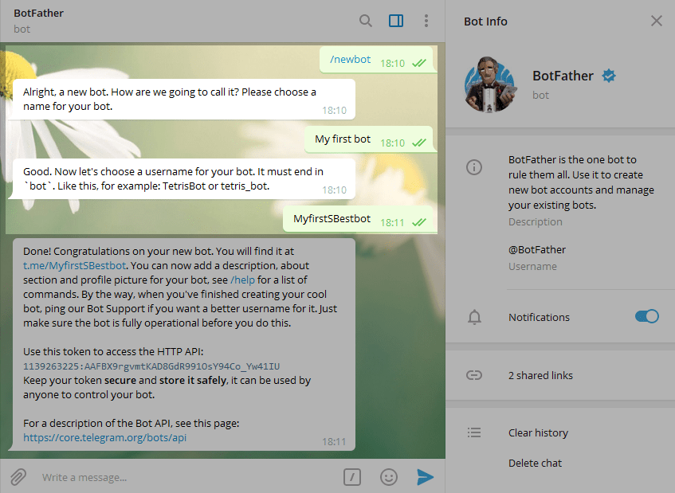
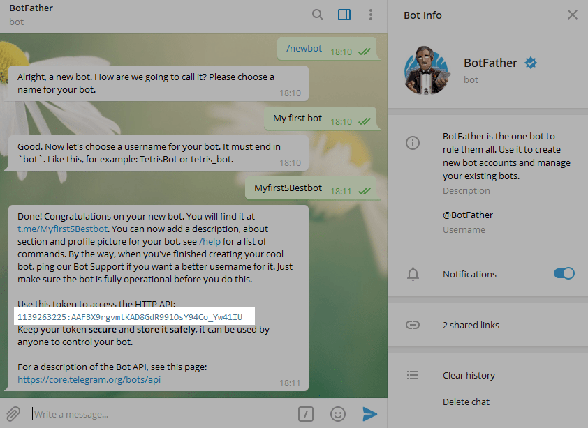

## Build and Run all services
```
# Create .env file and populate manually missing information, e.g tokens for telegram and OpenAI communications
cp .env.example .env 

# Build Docker Images
docker-compose build

# Generate python documentation for sphinx server locally, you must do it to wake up the entire docker-compose
docker-compose run openai-bot-sphinx sphinx-apidoc -o source/code ../src
docker-compose run openai-bot-sphinx make html

# Wake up all services
docker-compose up
```

## Database
To explore database using pgadmin visit http://localhost:8050 and login using admin@mail.com admin credentials
Register a server connection to the database using these informations:
```
host --> openai-bot-database
port --> 5432
db --> default
username --> admin
psw --> s3cr3t
```

## Docs
Visit http://localhost:9001 to have a local view of Sphinx documentation after waking up docker compose services.
If you have already generated teh Docs and want to re-create it, follow these steps:
```
# to clean
sudo rm -rd docs/build
sudo rm -rf docs/source/code

# OR to fix generated file for editing 
sudo chmod -R 777 docs/*
```

To generate the Python Docs:
```
docker-compose run openai-bot-sphinx sphinx-apidoc -o source/code ../src
docker-compose run openai-bot-sphinx make html 
```

Finally Wakeup all services
```
docker-compose up
```

# Telegram

## How to create a bot

**Step 1.** Enter @Botfather in the search tab and choose this bot.

Click “Start” to activate BotFather bot.

In response, you receive a list of commands to manage bots.

**Step 2**. Choose or type the `/newbot` command and send it.

**Step 3.** Choose a name for your bot — your subscribers will see it in the conversation. And choose a username for your bot — the bot can be found by its username in searches. The username must be unique and end with the word “bot.”

After you choose a suitable name for your bot — the bot is created. You will receive a message with a link to your bot t.me/<bot_username>, recommendations to set up a profile picture, description, and a list of commands to manage your new bot.

To connect a bot you need a token. Copy your token value and find more information about connecting your bot in the next steps.


## How to connect your bot

You can set up your webhook connection by calling this API pasting your bot token and setting the url of your server

```BASH
curl --request GET \
  --url 'https://api.telegram.org/<token>/setWebhook?url=<url>/telegram'
```
